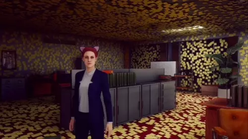

# SylphWeed's Stream Overlay

Borderless, transparent, click-through browser windows for streaming.

For example, you can show your Twitch chat and alerts on your display, over your game.

I made this app because I would often not notice my chat messages on my other monitor, and I'd prefer to have them come up on the display I'm looking at, rather than only in an OBS overlay. It's also great for single monitor streamers.



## Download

Head over to the [releases page](https://github.com/hperrin/stream-overlay/releases) to download the latest version.

## Notes

### Updates

You can check for updates through the system tray menu.

## Development

After checking out the repo, run the following in the repo's folder.

```sh
npm install
cd app/app
npm install
cd ../..
npm start
```

Under most circumstances, it's easiest to just Ctrl+C that instance and run `npm start` again, instead of running watchers.

When you've completed your changes and are ready to package it up, run the following.

```sh
npm run clean
npm run build
npm run package:windows # or package:linux
```

## Support Me

You can support me directly by supporting my email service, Port87:

https://port87.com/

You can also buy stuff from my merch shop, Ice Cream on a Hot Dog:

https://icecreamonahotdog.com/

You can also support me for free by following me on Twitch:

https://www.twitch.tv/sylphweed
