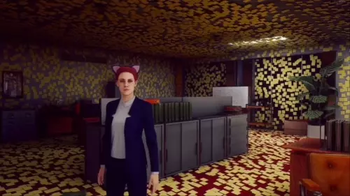

# SylphWeed's Stream Overlay

You can use this app to show borderless, transparent, click-through browser windows for streaming. For example, you can show your Twitch chat stream and alerts on your display, over your game.

I made this app because I would often not notice my chat messages on my other monitor, and I'd prefer to have them come up on the display I'm looking at, rather than only in OBS. It's also great for single monitor streamers.

## Download

Head over to the [releases page](https://github.com/hperrin/stream-overlay/releases) to download the latest version.

## Usage

Duplicate `config.template.json` in the `resources/app` folder to `config.json`, then open it (like with Notepad) and modify the values to the windows you need. Then run the "stream-overlay" app.

You can also use this app from the command line, by providing the URL as the argument. Use `stream-overlay --help` to see all the available options.

## Fullscreen Apps

Stream Overlay doesn't work over fullscreen apps, so your app needs to be in "borderless window" or "borderless fullscreen" to allow Stream Overlay on top of it. If it's still not appearing on top, try setting it to windowed mode then back to borderless.

## Interaction

When a window is focused (by clicking it on the taskbar/dock) it will have an opaque background, and a handle to drag it around. Once it loses focus, it will go back to transparent, and will ignore all mouse events. It will be click-through, so you can click the apps behind it.

## Support Me

You can support me directly by supporting my software company, SciActive, on Patreon:

https://www.patreon.com/sciactive

You can also support me for free by following me on Twitch:

https://www.twitch.tv/sylphweed
